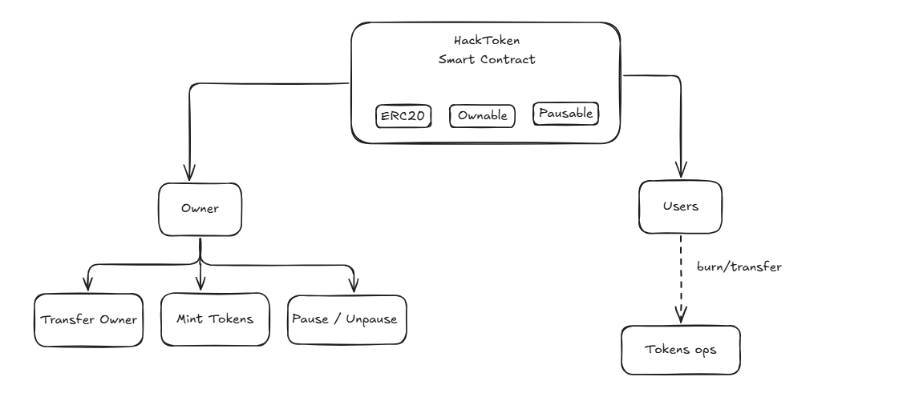
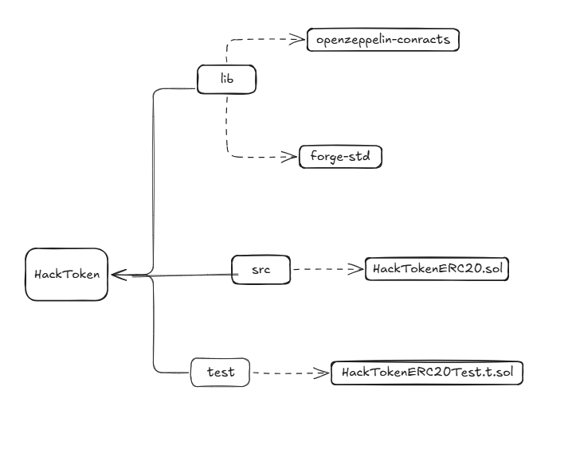

<<<<<<< HEAD

<div align="center">
  
# HackTokenERC20 - Advanced ERC20 Token with Security Controls  

&nbsp;
&nbsp;
&nbsp;


---



</div>
--

HackTokenERC20 is an advanced ERC20 token built with **OpenZeppelin** and designed for maximum security and administrative control. It includes features for **minting**, **burning**, **pausable transfers**, and **ownership transfer**, ideal for DeFi projects, DAOs, or platforms requiring robust governance. 

---

## :gear: Live Deployment
- **Token Contract:** 0x38dFe380E1582752a4131D8231183C5e2A406532
- **Token Name:** Hacktoken
- **Token Name:** HACK
- **Decimals:** 18

---

## 🚀 Key features
- **Standard ERC20 Token:** Based on the widely audited ERC20 standard
- **Controlled Minting:** Only the contract owner can mint new tokens
- **Flexible Burning:** Any user can burn their own tokens
- **Pausable Transfers:** The owner can pause/unpause the token in emergencies
- **Ownership Transfer:** Simple and secure contract ownership management
- **Eventos Detallados:**  Emits clear events for audits and monitoring

---
<div align="center">
  
##  Proyect Structure
</div>

<div align="center">



</div>


## 🔒 Security Features

- Ownable Access Control
- Pausable Contract
- Custom Errors
- Zero Address Checks
- Burn Function with Balance Check
- Event Logging
- Standard OpenZeppelin Contracts

---

## 🛠 Technologies   
- **Lenguaje:** Solidity ^0.8.24  
- **Framework:** [Foundry](https://book.getfoundry.sh/)  
- **Librerías:**  
  - [OpenZeppelin Contracts](https://github.com/OpenZeppelin/openzeppelin-contracts)  
    - ERC20, Ownable, Pausable  
- **Redes:** Compatible with any EVM network (Ethereum, Arbitrum, Optimism, Polygon, etc.) 

---

## 📦 Installation  
1. Clone the repository
```bash
git clone https://github.com/ivanramirez2/HackTokenERC20.git
cd HackTokenERC20
```
2. Install dependencies
```bash
forge install
```


=======
## Foundry

**Foundry is a blazing fast, portable and modular toolkit for Ethereum application development written in Rust.**

Foundry consists of:

- **Forge**: Ethereum testing framework (like Truffle, Hardhat and DappTools).
- **Cast**: Swiss army knife for interacting with EVM smart contracts, sending transactions and getting chain data.
- **Anvil**: Local Ethereum node, akin to Ganache, Hardhat Network.
- **Chisel**: Fast, utilitarian, and verbose solidity REPL.

## Documentation

https://book.getfoundry.sh/

## Usage

### Build

```shell
$ forge build
```

### Test

```shell
$ forge test
```

### Format

```shell
$ forge fmt
```

### Gas Snapshots

```shell
$ forge snapshot
```

### Anvil

```shell
$ anvil
```

### Deploy

```shell
$ forge script script/Counter.s.sol:CounterScript --rpc-url <your_rpc_url> --private-key <your_private_key>
```

### Cast

```shell
$ cast <subcommand>
```

### Help

```shell
$ forge --help
$ anvil --help
$ cast --help
```
>>>>>>> a9dbc64 (Update HackTokenERC20: custom errors, burn restricted to owner, and pausable transfers)
